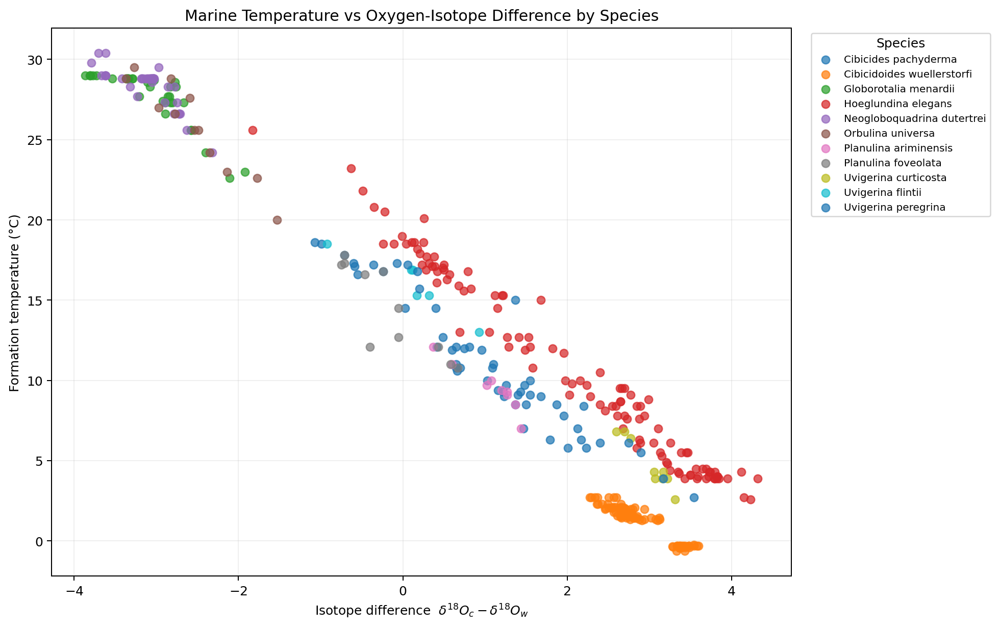
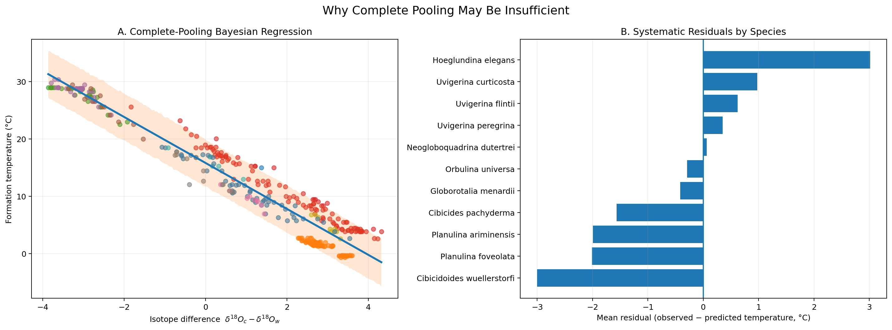
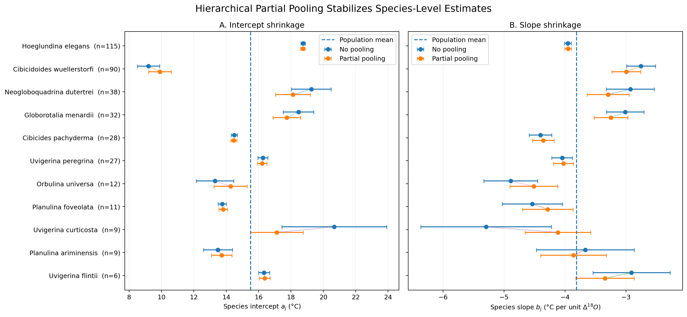
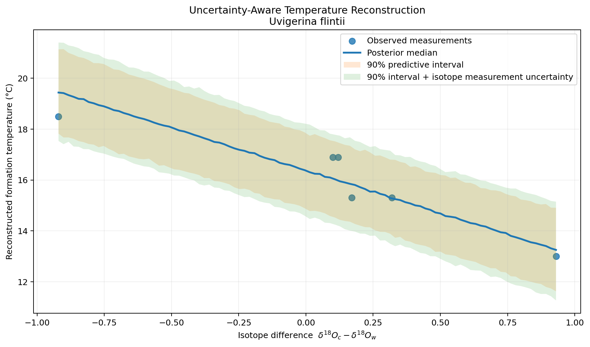

# Bayesian Marine Temperature Reconstruction

**Hierarchical Bayesian modelling of marine oxygen-isotope measurements with Stan, CmdStanPy, and Databricks**

This repository presents a reproducible research-engineering workflow for Bayesian marine temperature reconstruction using oxygen-isotope measurements. The scientific goal is simple:

> **Can oxygen-isotope measurements be used to reconstruct marine carbonate formation temperature, and does that relationship differ between species?**

The project compares three Bayesian regression strategies—**complete pooling**, **species-specific no pooling**, and **hierarchical partial pooling**—then uses the hierarchical model for **uncertainty-aware temperature reconstruction**.

> **Data note:** the original dataset was supplied for Utrecht University coursework and is **not distributed in this repository**. The code, Stan models, validation logic, figures, and analysis workflow are public. Exact numerical reproduction of the reported results requires access to the original data or a compatible dataset with the same schema.

---

## At a glance

| Item | Value |
|---|---|
| Observations | 377 |
| Species | 11 |
| Locations | 167 |
| Source papers represented in the source data | 4 |
| Temperature range | -0.64°C to 30.4°C |
| Platform used | Databricks Free Edition |
| Bayesian engine | Stan via CmdStanPy |
| Inference | 4-chain HMC/NUTS MCMC |
| Models | Complete pooling, no pooling, hierarchical partial pooling |
| Validation | MCMC diagnostics, posterior predictive checks, residual analysis, PSIS-LOO |
| Final output | Posterior temperature reconstruction with measurement-uncertainty propagation |

---

## 1. Scientific idea in plain language

Marine organisms form carbonate material under different environmental conditions. Two useful measurements are:

- $\delta^{18}O_c$: oxygen-isotope composition measured in the carbonate/skeleton;
- $\delta^{18}O_w$: oxygen-isotope composition of the surrounding seawater.

The model uses their difference:

$$
x_i = \delta^{18}O_{c,i} - \delta^{18}O_{w,i}.
$$

The basic assumption is that formation temperature $T_i$ is approximately related to this isotope difference through a linear relationship:

$$
T_i = a + b x_i + \epsilon_i,
\qquad
\epsilon_i \sim \mathcal{N}(0,\sigma_T).
$$

Here:

- $a$ is the intercept: the modelled temperature when the isotope difference is zero;
- $b$ is the slope: how much the modelled temperature changes for a one-unit increase in isotope difference;
- $\sigma_T$ is residual temperature variation not explained by the regression.

In the data, the overall relationship is strongly negative: larger isotope differences generally correspond to lower formation temperatures. But the important question is whether **one common line is appropriate for all species**.

---

## 2. Why species matter

The exploratory plot shows a strong overall temperature–isotope relationship, but observations are also visibly structured by species.



**How to read this figure:** each point is one observation. The x-axis is the isotope difference and the y-axis is measured formation temperature. Different species occupy different parts of the relationship, motivating a model that can represent species-specific behaviour rather than forcing every species onto one identical line.

Sample sizes are also highly unbalanced. For example:

- *Hoeglundina elegans*: $n=115$
- *Cibicidoides wuellerstorfi*: $n=90$
- *Uvigerina curticosta*: $n=9$
- *Uvigerina flintii*: $n=6$

This matters because estimating a completely independent regression for a species with only a few observations can be unstable.

---

## 3. From data to reconstruction


The workflow deliberately separates:

1. **data quality**,
2. **model fitting**,
3. **sampling diagnostics**,
4. **model criticism**,
5. **predictive comparison**, and
6. **scientific reconstruction**.

That structure is useful in research software because a model that compiles and samples successfully is not automatically a model that represents the data well.

---

# 4. Bayesian inference and MCMC — a clear explanation

## 4.1 What Bayesian inference is doing

Suppose the unknown parameters of a model are collected in

$$
\theta = (a,b,\sigma_T,\ldots).
$$

Bayesian inference combines:

- a **prior**, $p(\theta)$: what parameter values are plausible before seeing the current data;
- a **likelihood**, $p(y\mid\theta)$: how well particular parameter values explain the observed data.

Bayes' rule gives the posterior distribution:

$$
p(\theta\mid y)
\propto
p(y\mid\theta)\,p(\theta).
$$

The posterior is not just one "best" answer. It is a **distribution of plausible parameter values after observing the data**.

That is important because scientific reconstruction should communicate uncertainty rather than return only a single fitted line.

---

## 4.2 Why MCMC is needed

For realistic Bayesian models, the posterior distribution is usually too complicated to calculate analytically.

**Markov Chain Monte Carlo (MCMC)** solves this by generating many draws from the posterior distribution.

A useful mental model is:

> Instead of fitting one regression line and pretending it is known exactly, MCMC gives us thousands of plausible regression lines and parameter combinations that are consistent with the data and the model.

For example, one posterior draw might contain

$$
(a,b,\sigma_T)=(15.7,-3.9,0.84),
$$

while another plausible draw may contain

$$
(a,b,\sigma_T)=(15.4,-3.8,0.87).
$$

Taken together, thousands of such draws approximate the posterior distribution.

---

## 4.3 What Stan does

This project uses **Stan** through **CmdStanPy**.

Stan's MCMC engine uses **Hamiltonian Monte Carlo (HMC)** and its adaptive **No-U-Turn Sampler (NUTS)**. Rather than moving randomly through parameter space, HMC uses gradient information to explore high-probability regions efficiently.

Each model was sampled with:

```text
4 independent chains
1,000 warmup iterations per chain
1,000 retained sampling iterations per chain
-----------------------------------------------
4,000 retained posterior draws
```

### Warmup versus sampling

During **warmup**, NUTS learns numerical settings such as step size and the geometry needed to explore the posterior efficiently. Warmup draws are not used for posterior summaries.

After warmup, the tuned sampler generates the draws used for inference.

---

## 4.4 How we know MCMC worked

For all three models, CmdStan diagnostics reported:

- no divergent transitions;
- satisfactory treedepth;
- satisfactory E-BFMI;
- satisfactory effective sample sizes;
- rank-normalized split $\hat{R}$ values close to 1.

A simple interpretation of $\hat{R}$ is:

> Did the independent chains explore the same posterior distribution?

Values close to 1 indicate that the chains agree. In this project, all reported $\hat{R}$ values were approximately 1.

**Important:** good MCMC diagnostics mean the sampler successfully explored the specified model. They do **not** prove that the model itself is scientifically adequate. That is why the project also uses posterior predictive checks, residual analysis, and predictive model comparison.

---

# 5. Model 1 — Complete pooling

The complete-pooling model assumes one common regression for every species:

$$
T_i
\sim
\mathcal{N}
\left(
a+b x_i,\,
\sigma_T
\right).
$$

Posterior estimates were:

| Parameter | Posterior mean | Posterior SD |
|---|---:|---:|
| $a$ | 15.842 | 0.137 |
| $b$ | -4.008 | 0.055 |
| $\sigma_T$ | 2.486°C | 0.087 |

So the common regression is approximately

$$
T \approx 15.84 - 4.01x.
$$

The model captures the broad relationship surprisingly well, but posterior predictive checking and species-level residuals reveal an important problem.



**Left:** the global Bayesian regression follows the overall trend.  
**Right:** the errors are systematically positive for some species and negative for others.

For example, *Hoeglundina elegans* is underpredicted on average, while *Cibicidoides wuellerstorfi* is overpredicted. The errors are therefore not simply random noise around one universal line.

The posterior predictive model reproduced the overall mean and standard deviation well, but generated more extreme minima and maxima than were observed:

| Statistic | Observed | Predictive 5% | Predictive median | Predictive 95% |
|---|---:|---:|---:|---:|
| Mean | 12.18 | 11.88 | 12.18 | 12.48 |
| Standard deviation | 9.90 | 9.60 | 9.89 | 10.20 |
| Minimum | -0.64 | -7.14 | -4.69 | -3.02 |
| Maximum | 30.40 | 33.33 | 35.12 | 37.52 |

This motivates a species-aware model.

---

# 6. Model 2 — No pooling

The no-pooling model gives each species $j$ its own intercept and slope:

$$
T_i
\sim
\mathcal{N}
\left(
a_{j[i]} + b_{j[i]}x_i,\,
\sigma_T
\right).
$$

This substantially reduces residual variation:

$$
\sigma_T:
\quad
2.486^\circ\text{C}
\rightarrow
0.833^\circ\text{C}.
$$

That is approximately a **66.5% reduction** in residual standard deviation relative to complete pooling.

The result confirms that species identity contains important structure that the global model was missing.

However, no pooling treats every species as statistically unrelated. That creates a new problem: a species with 6 observations is allowed to estimate its line as independently as a species with 115 observations.

---

# 7. Model 3 — Hierarchical partial pooling

The hierarchical model keeps species-specific regressions but assumes that species belong to a common population.

$$
a_j \sim \mathcal{N}(a,\sigma_a),
$$

$$
b_j \sim \mathcal{N}(b,\sigma_b).
$$

The observation model remains

$$
T_i
\sim
\mathcal{N}
\left(
a_{j[i]}+b_{j[i]}x_i,\,
\sigma_T
\right).
$$

The implementation uses a non-centred parameterisation:

$$
a_j = a+\sigma_a z_{a,j},
\qquad z_{a,j}\sim\mathcal{N}(0,1),
$$

$$
b_j = b+\sigma_b z_{b,j},
\qquad z_{b,j}\sim\mathcal{N}(0,1).
$$

### Intuition: what does partial pooling mean?

Imagine the 11 species as 11 small studies.

- **Complete pooling:** "All species are identical; use one line."
- **No pooling:** "Every species is unrelated; estimate 11 independent lines."
- **Partial pooling:** "Species can differ, but they are related enough to share information."

This is particularly helpful for species with little data.

The hierarchical population-level results were:

| Parameter | Posterior mean | Interpretation |
|---|---:|---|
| $a$ | 15.513 | Typical population intercept |
| $b$ | -3.810 | Typical population slope |
| $\sigma_a$ | 3.024 | Between-species intercept variation |
| $\sigma_b$ | 0.699 | Between-species slope variation |
| $\sigma_T$ | 0.837°C | Remaining within-species residual variation |

The typical modelled relationship therefore has a negative slope: a one-unit increase in isotope difference corresponds to about a **3.81°C decrease in modelled formation temperature**, although individual species have their own slopes.

---

## 7.1 Shrinkage: the key hierarchical result



Each species has:

- a blue no-pooling estimate;
- an orange partial-pooling estimate;
- an uncertainty interval;
- a dashed population-level reference.

The central hierarchical effect is **shrinkage**.

For a well-sampled species such as *Hoeglundina elegans* ($n=115$), the data are strong, so partial pooling changes the estimate very little.

For a sparsely sampled species such as *Uvigerina curticosta* ($n=9$), the independent estimate is much more uncertain. Partial pooling moves the estimate toward the population relationship and reduces its uncertainty.

Example:

| Quantity | No pooling | Partial pooling |
|---|---:|---:|
| *U. curticosta* intercept | $20.676 \pm 3.235$ | $17.125 \pm 1.629$ |
| *U. curticosta* slope | $-5.294 \pm 1.073$ | $-4.117 \pm 0.539$ |

This does **not** mean the model forces all species to be the same. It means that uncertain species estimates require stronger evidence before moving far away from the population-level relationship.

---

# 8. Predictive comparison with PSIS-LOO

The models were compared with **Pareto-smoothed importance-sampling leave-one-out cross-validation (PSIS-LOO)**.

In simple terms, LOO asks:

> If one observation had not been used for fitting, how well would the fitted model predict it?

Higher ELPD-LOO values indicate better expected out-of-sample predictive performance.

| Model | ELPD-LOO | SE | $p_{\text{LOO}}$ | Max Pareto $k$ |
|---|---:|---:|---:|---:|
| Complete pooling | -879.43 | 9.28 | 2.04 | 0.10 |
| No pooling | -479.11 | 22.52 | 24.27 | 0.90 |
| Partial pooling | -479.24 | 22.15 | 21.90 | 0.75 |

Two conclusions are important.

### 1. Species-aware modelling clearly matters

Both species-aware models are dramatically better than complete pooling.

### 2. No pooling and partial pooling are predictively tied

Their ELPD values differ by only about 0.13, which is negligible relative to the uncertainty of the comparison.

Therefore, this project does **not** claim that partial pooling "wins" because of a tiny numerical LOO difference.

Instead, partial pooling is preferred as the final scientific model because it provides:

- essentially the same predictive performance as no pooling;
- slightly lower effective complexity;
- explicit population-level structure;
- more stable estimates for sparsely sampled species.

### Pareto-$k$ caution

One influential observation was detected:

- species: *Uvigerina flintii*;
- location: `84G4-13`;
- temperature: 18.5°C;
- isotope difference: -0.92;
- Pareto $k$, no pooling: 0.899;
- Pareto $k$, partial pooling: 0.747.

Because one observation remains above the usual $k=0.70$ warning threshold, the extremely small LOO difference between no pooling and partial pooling should not be overinterpreted.

---

# 9. Uncertainty-aware temperature reconstruction

The hierarchical posterior can now be used in the scientifically useful direction: **start with new isotope measurements and reconstruct a temperature distribution**.

For a known species $j$,

$$
T =
a_j+b_j(\delta^{18}O_c-\delta^{18}O_w).
$$

But $a_j$ and $b_j$ are not known exactly. MCMC gave us thousands of plausible values for them.

For every posterior draw, the reconstruction therefore:

1. takes a plausible $a_j$;
2. takes a plausible $b_j$;
3. computes the expected temperature;
4. includes residual uncertainty $\sigma_T$;
5. optionally samples plausible isotope measurements from their reported measurement uncertainties.

The result is a **distribution of possible reconstructed temperatures**, not just one number.



The example uses *Uvigerina flintii*, the smallest group in the dataset ($n=6$).

The inner predictive interval reflects:

- posterior parameter uncertainty;
- residual temperature variability.

The slightly wider outer interval additionally propagates uncertainty in the isotope measurements.

For example, at

$$
\delta^{18}O_c-\delta^{18}O_w=0,
$$

the posterior median reconstructed temperature is approximately

$$
16.39^\circ\text{C}.
$$

The 90% predictive interval is approximately

$$
[14.89,\;17.87]^\circ\text{C},
$$

and after propagating isotope-measurement uncertainty it widens to approximately

$$
[14.59,\;18.22]^\circ\text{C}.
$$

That widening is the practical value of uncertainty propagation: the final result reflects both **model uncertainty and measurement uncertainty**.

---

# 10. Main findings

1. **There is a strong negative overall relationship between isotope difference and formation temperature.**

2. **One universal regression is not sufficient.** Complete pooling leaves systematic species-dependent residuals and residual uncertainty of about 2.49°C.

3. **Species-aware modelling explains substantial additional structure.** Residual uncertainty falls to about 0.83–0.84°C.

4. **Hierarchical partial pooling retains the strong predictive performance of independent species models while stabilising uncertain species-level estimates.**

5. **Bayesian posterior draws make uncertainty propagation natural.** The final reconstruction returns a temperature distribution rather than a single deterministic prediction.

---

# 11. What was added beyond the original coursework

This public portfolio version preserves the central scientific modelling problem while adding a clearer research-engineering layer:

- explicit schema and type validation;
- validation of measurement-uncertainty fields;
- modular Stan programs in separate files;
- weakly informative priors rather than data-derived priors;
- four-chain MCMC with explicit convergence diagnostics;
- posterior predictive checks;
- species-level residual diagnostics;
- reusable species encoding;
- hierarchical shrinkage analysis;
- PSIS-LOO predictive comparison and Pareto-$k$ diagnostics;
- reusable temperature-reconstruction function;
- explicit measurement-uncertainty propagation;
- Git-oriented repository structure and documentation;
- separation of private source data from public code.

These additions make the project closer to a small **scientific software workflow** rather than a notebook that only demonstrates model fitting.

---

# 12. Repository structure

```text
bayesian-marine-temperature-reconstruction/
│
├── README.md
│
├── notebooks/
│   └── bayesian_temperature_reconstruction.ipynb
│
├── stan/
│   ├── complete_pooling.stan
│   ├── species_model.stan
│   └── hierarchical_model.stan
│
├── figures/
│   ├── isotope_temperature_by_species.png
│   ├── complete_pooling_diagnostics.png
│   ├── partial_pooling_shrinkage.png
│   └── temperature_reconstruction_uncertainty.png
│
├── requirements.txt
├── .gitignore
└── LICENSE
```

The original assignment PDF and original CSV are intentionally excluded.

---

# 13. Data schema

The private source dataset used in the project contains the following fields:

| Column | Role |
|---|---|
| `ID` | Source record identifier |
| `paper` | Source-paper identifier |
| `location` | Sampling/location identifier |
| `species` | Species name |
| `temperature` | Observed formation temperature |
| `d18_O_w` | Seawater oxygen-isotope measurement |
| `d18_O` | Carbonate/skeleton oxygen-isotope measurement |
| `d18_O_sd` | Measurement uncertainty for `d18_O` |
| `d18_O_w_sd` | Measurement uncertainty for `d18_O_w` |
| `class` | Organism class |
| `functional_group` | Functional-group metadata |
| `composition` | Composition metadata |

The main derived feature is

```python
df["isotope_diff"] = df["d18_O"] - df["d18_O_w"]
```

A compatible dataset can be used with the notebook if these required modelling fields are supplied.

---

# 14. Reproducing the workflow

## Option A — Databricks Free Edition

This project was developed and tested in Databricks Free Edition.

### 1. Clone the repository into a Databricks Git folder

Open the repository as a Databricks Git folder so that notebooks and ordinary project files remain version-controlled.

### 2. Install Python dependencies

From the notebook:

```python
%pip install -r ../requirements.txt
```

If the environment does not resolve the relative requirements file, install the packages directly:

```python
%pip install cmdstanpy arviz numpy pandas matplotlib
```

### 3. Install/verify CmdStan

```python
import cmdstanpy

cmdstanpy.install_cmdstan()
print(cmdstanpy.cmdstan_path())
```

CmdStan requires compilation support in the runtime. This workflow was successfully tested in Databricks Free Edition with a simple compiled Stan model before running the project models.

### 4. Provide the dataset privately

For example, place an authorised copy in a Databricks Volume:

```text
/Volumes/<catalog>/<schema>/<volume>/merged_data.csv
```

Then update:

```python
DATA_PATH = "/Volumes/<catalog>/<schema>/<volume>/merged_data.csv"
```

Do not copy restricted source data into the Git folder.

### 5. Run the notebook from top to bottom

The notebook:

- validates the input;
- constructs isotope difference;
- fits all three Stan models;
- checks sampler diagnostics;
- performs posterior predictive assessment;
- compares models with PSIS-LOO;
- generates all figures;
- performs posterior temperature reconstruction.

---

# 15. Stan programs

## `complete_pooling.stan`

One intercept and one slope for all observations.

Purpose: establish a simple baseline.

## `species_model.stan`

Independent intercept and slope for every species.

Purpose: test whether species-specific relationships explain the systematic residual structure missed by complete pooling.

## `hierarchical_model.stan`

Species-specific parameters linked through population distributions.

Purpose: preserve genuine species differences while sharing information across groups, particularly where sample sizes are small.

All models generate:

- posterior predictive temperatures, `temperature_rep`;
- pointwise log likelihoods, `log_lik`.

These support posterior predictive checking and PSIS-LOO evaluation without changing the fitted likelihood.

---

# 16. Important limitations

This is a compact scientific modelling project, not a complete palaeoclimate reconstruction system.

- **Original data are not public.** Exact numerical reproduction requires authorised access to the source dataset.
- **The analysis is associative/model-based, not causal.**
- **Training isotope measurements are treated as observed inputs.** Measurement uncertainty is explicitly propagated in the final new-temperature reconstruction, but a full errors-in-variables likelihood is not fitted to the training data.
- **Species sample sizes are unbalanced**, ranging from 6 to 115 observations.
- **One observation remains influential in PSIS-LOO** for the species-aware models, so tiny predictive differences between no pooling and partial pooling are not treated as meaningful.
- **Location is metadata, not a spatial model input.** This is geoscience-oriented probabilistic modelling, not a GIS or GeoQA workflow.
- The linear functional form is intentionally retained from the original scientific modelling setup; more flexible relationships would require additional scientific justification and validation.

---

# 17. Research-engineering perspective

Although the scientific example is compact, the workflow demonstrates several practices that generalise to research software:

- turning scientific assumptions into explicit executable models;
- validating data before analysis;
- separating model code from orchestration code;
- making uncertainty part of the output;
- checking computational convergence independently from scientific fit;
- comparing alternative modelling assumptions;
- tracing influential observations;
- documenting limitations and data-access constraints;
- keeping restricted data outside version control;
- producing reusable figures and functions rather than one-off outputs.

---

# 18. Academic origin and attribution

This repository is a refactored and extended portfolio version of work originating from **Probabilistic Reasoning — Assignment C (2023), Utrecht University**.

The original coursework submission was completed collaboratively by **Seyed Masoud Aghayan and Tingyang Jiao**.

The original assignment document and source CSV are not included in this repository. The public repository reorganises the modelling workflow, adds validation and evaluation components, and documents the analysis as a reproducible research-software project.

---

# 19. Software and references

Core software:

- **Stan** — probabilistic programming and Bayesian inference
- **CmdStanPy** — Python interface to CmdStan
- **ArviZ** — Bayesian diagnostics and PSIS-LOO analysis
- **NumPy / pandas** — data handling
- **Matplotlib** — visualisation
- **Databricks Free Edition** — notebook execution and Git-based project development

Useful official documentation:

- Stan User's Guide: https://mc-stan.org/docs/stan-users-guide/
- CmdStanPy MCMC sampling: https://mc-stan.org/cmdstanpy/users-guide/examples/MCMC%20Sampling.html
- Stan posterior predictive checks: https://mc-stan.org/docs/stan-users-guide/posterior-predictive-checks.html
- ArviZ PSIS-LOO: https://python.arviz.org/en/stable/api/generated/arviz.loo.html
- Databricks Git folders: https://docs.databricks.com/aws/en/repos/

---

## License

The code and documentation in this repository are released under the MIT License. The original Utrecht University assignment materials and source dataset are **not** covered by this repository's license and are not redistributed here.
